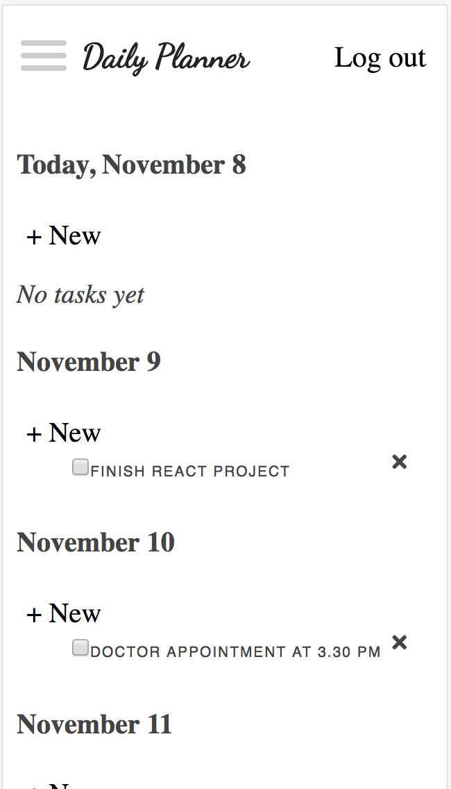

# Daily Planner App
Daily Planner app lets you stay organized by keeping all your day-to-day tasks in 1 place.
The app lets the users to add, edit and delete the tasks and goals for the next 7 days, mark already 
completed ones.

## Demo
- [Live Demo](https://daily-planner-app.herokuapp.com/)

## Server side
- https://github.com/annasheik/daily-planner-api

## Screenshots

Landing page:

Login Page:

User Dashboard:

Mobile Application/ Fully responsive

## Built With
## Front End 

- HTML5
- CSS
- jQuery
- JavaScript
- React / Redux
- Enzyme
## Back end

- Node.js
- Express.js
- Mocha
- Chai
- Mongo
- Mongoose
- mLab
- bcrypt.js
- Passport
- TravisCI
- Heroku
